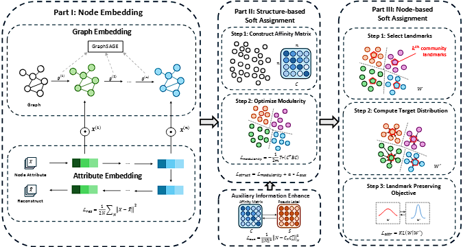

# RDSA
This is the offical reponstory of Robust Deep Graph Clustering via Dual Soft Assignment
## Model

## Requirements
#### The code is tested under the following environment:
- Python 3.11
- PyTorch 2.2.0
- PyTorch Geometric 2.5.2
- Numpy 1.24.3
- Scipy 1.10.1
- Scikit-learn 1.2.2
- Networkx 3.3
- Munkres 1.1.4
#### Create a new conda environment and install the required packages
```
conda create -n rdsa python=3.11
conda activate rdsa

# Default PyTorch version is CPU version, you can change it to GPU version according to your needs
# Comment out the CPU version and uncomment the GPU version in requirements.txt
conda install --yes --file requirements.txt
```
## Run
### Cora
Pre-training Auto-Encoder
```
python pretrain_ae.py --dataset cora --epochs 500 --device cuda
```
Train model
```
python train.py --dataset cora --sigma 0.5 --num_clusters 7 --gcn_model gcn --noise_level 0 --n_runs 5 --epochs 300 --device cuda
```
### Citeseer
Pre-training Auto-Encoder
```
python pretrain_ae.py --dataset citeseer --epochs 500 --device cuda
```
Train model
```
python train.py --dataset citeseer --sigma 0.5 --num_clusters 6 --gcn_model gcn --noise_level 0 --n_runs 5 --epochs 300 --device cuda
```
### PubMed
Pre-training Auto-Encoder
```
python pretrain_ae.py --dataset pubmed --epochs 500 --device cuda
```
Train model
```
python train.py --dataset pubmed --sigma 0.5 --num_clusters 3 --gcn_model gcn --noise_level 0 --n_runs 5 --epochs 300 --device cuda
```
### Amazon Photo
Pre-training Auto-Encoder
```
python pretrain_ae.py --dataset photo --epochs 500 --device cuda
```
Train model
```
python train.py --dataset photo --sigma 0.8 --num_clusters 8 --gcn_model gcn --noise_level 0 --n_runs 5 --epochs 300 --device cuda
```
### Amazon Computers
Pre-training Auto-Encoder
```
python pretrain_ae.py --dataset computers --epochs 500 --device cuda
```
Train model
```
python train.py --dataset computers --sigma 0.4 --num_clusters 10 --gcn_model gcn --noise_level 0 --n_runs 5 --epochs 300 --device cuda
```
### ogbn arxiv
Pre-training Auto-Encoder
```
python pretrain_ae.py --dataset ogbn-arxiv --epochs 500 --device cuda
```
Train model
```
python train.py --dataset ogbn-arxiv --sigma 0.5 --num_clusters 40 --gcn_model sage --batch_size 3200 --n_runs 5 --epochs 300 --device cuda
```
