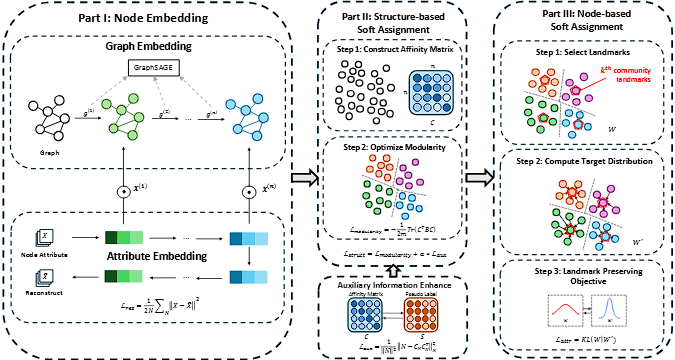

# RDSA
This is the official repository of the DASFAA 2025 paper [***RDSA: A Robust Deep Graph Clustering Framework via Dual Soft Assignment***](https://doi.org/10.1007/978-981-95-3906-2_16).
## Model

## Requirements
#### The code is tested under the following environment:
- Python 3.11
- PyTorch 2.2.0
- PyTorch Geometric 2.5.2
- Numpy 1.24.3
- Scipy 1.10.1
- Scikit-learn 1.2.2
- Networkx 3.3
- Munkres 1.1.4
#### Create a new conda environment and install the required packages
```
conda create -n rdsa python=3.11
conda activate rdsa

# Default PyTorch version is CPU version, you can change it to GPU version according to your needs
# Comment out the CPU version and uncomment the GPU version in requirements.txt
conda install --yes --file requirements.txt
```
## Run
We have included hyperparameters for different datasets in the `train.py` file. You can run the code using the following command:
#### Pre-training Auto-Encoder
```
python pretrain_ae.py --dataset <dataset_name> --device cuda
```
#### Train model
```
python train.py --dataset <dataset_name> --noise_level 0 --n_runs 5 --device cuda
```

## Random Noise Generation
The `add_noise_edge` method in `dataset.py` introduces noise to a graph by adding random edges between unconnected nodes that belong to different classes. It uses the specified noise level to determine the proportion of noise edges relative to the original graph structure, ensuring that the noise maintains inter-class connectivity while avoiding links between nodes of the same class. The modified edge list reflects this added noise while preserving the graph’s overall structure.
#### Usage
Run the `main` method in `dataset.py` to generate a noisy graph or train the model with:
```
python train.py --dataset <dataset_name> --noise_level <noise_level> --n_runs 5 --device cuda
```

## Citation
```
@inproceedings{yang2025rdsa,
  title={RDSA: A Robust Deep Graph Clustering Framework via Dual Soft Assignment},
  author={Xiang, Yang and Fan, Li and Tulika, Saha and Pang, Xiaoying and Pan, Yushan and Zhang, Haiyang and Ji, Chengtao},
  booktitle="Database Systems for Advanced Applications",
  year="2026",
  publisher="Springer Nature Singapore",
  address="Singapore",
  pages="253--263",
  isbn="978-981-95-3906-2"
}
```
